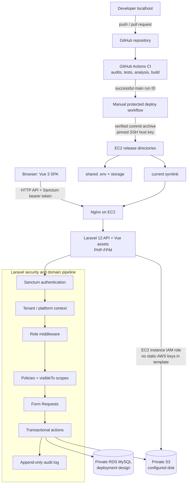
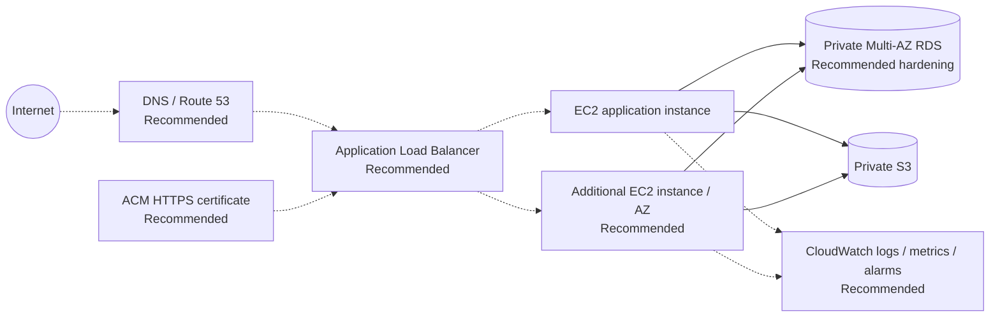

# SchoolTry Architecture Diagrams

## Implemented application and repository-supported deployment design

The repository configures the application and deployment process but does not provision or inspect AWS resources. Private RDS/S3 and the EC2 IAM role are requirements of the checked-in deployment design.

## Recommended production edge and availability enhancement

Dashed paths and nodes labeled **Recommended** are not created by this repository and must not be interpreted as verified live infrastructure.
