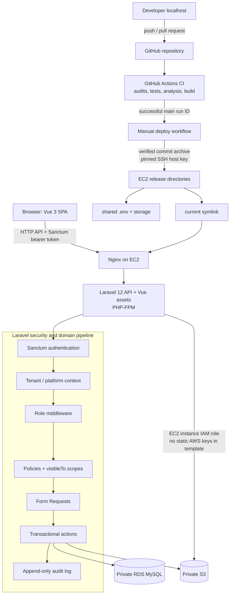

# SchoolTry Architecture Diagrams

## Application and deployment architecture

The repository contains the application and deployment configuration. The assessment deployment uses EC2, RDS MySQL, private S3 storage, and an EC2 IAM role.
