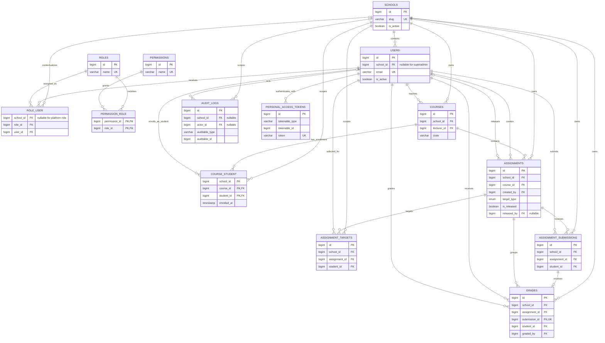

# SchoolTry ER Diagram

## Notes

- `ROLE_USER` is the real many-to-many bridge between users and roles. Its unique key is `(role_id, user_id)` after the platform extension; `school_id` remains a foreign key and tenant index component.
- A platform superadmin is the deliberate exception to ordinary tenant membership: both `users.school_id` and the related `role_user.school_id` are null. Platform middleware requires that combination and the `superadmin` role.
- `AUDIT_LOGS.auditable_type` plus `auditable_id` is polymorphic application metadata, not a database foreign key to every auditable table; no invented target relationship is drawn.
- `PERSONAL_ACCESS_TOKENS.tokenable_type/tokenable_id` is also polymorphic. SchoolTry currently issues tokens to `User` records.
- The database has direct user foreign keys for creator, releaser, lecturer, student, grader, and audit actor roles. The relationship labels distinguish those meanings.
